# Seedless Wallet

A passkey-native Solana wallet. No seed phrases. No gas fees. Just biometrics.

> Currently in **Phase 3 Beta** on Solana devnet. Mainnet launch pending infrastructure partner audit.

## Download

**[Android APK](https://expo.dev/accounts/solana-bridge/projects/seedless/builds/58386687-b1e2-4d43-a6cc-4efcba8f27ac)**

## Screenshots

### Passkey Authentication
<p align="left">
  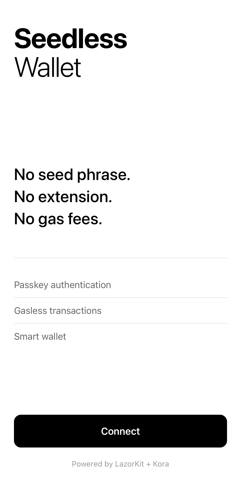
  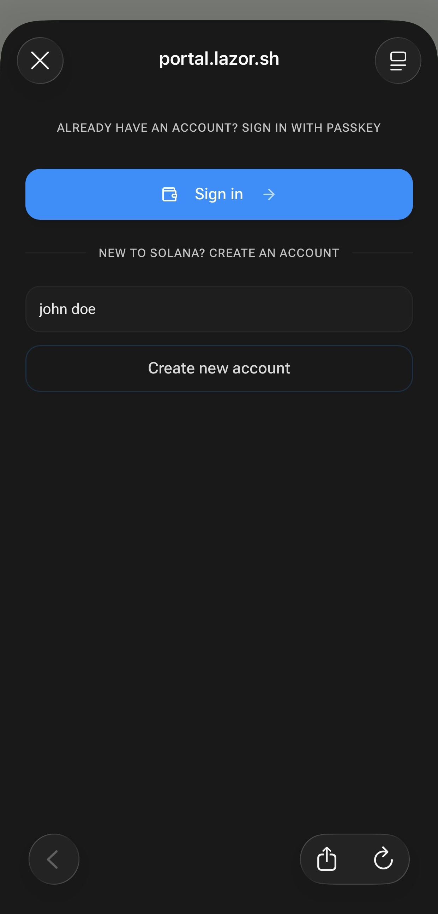
  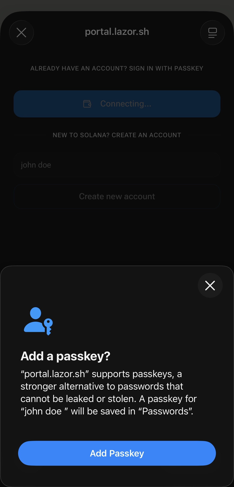
</p>

### Wallet
<p align="left">
  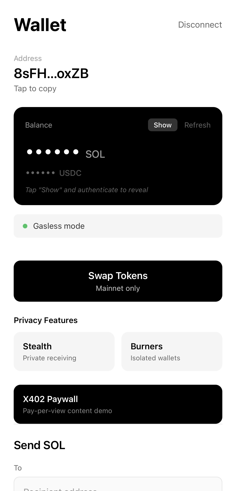
  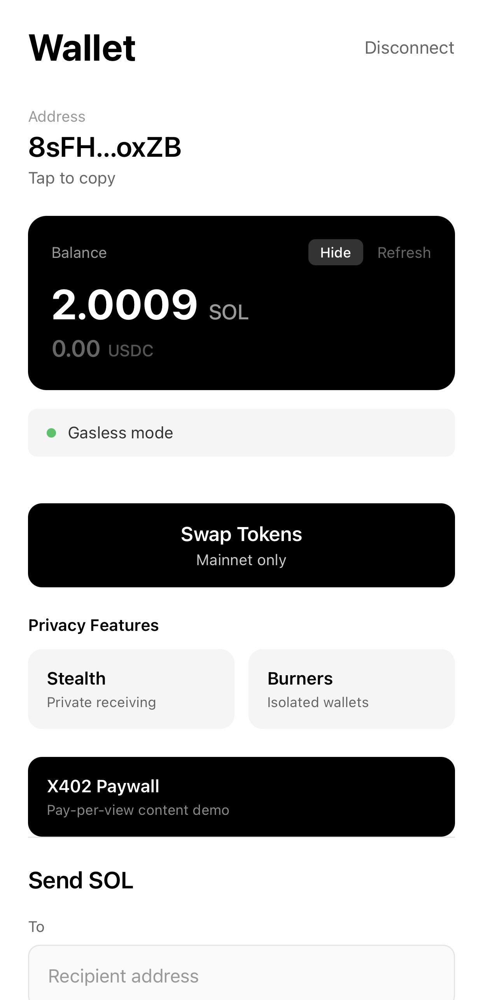
</p>

### Gasless Transfers
<p align="left">
  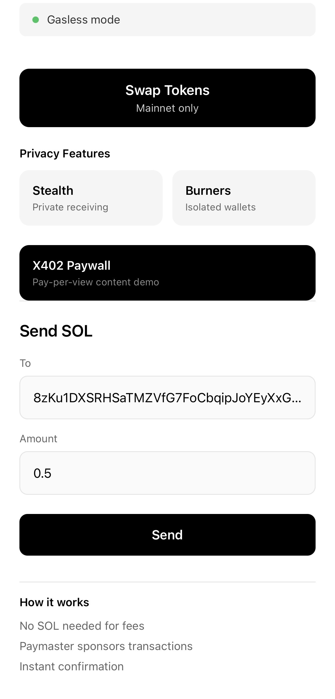
  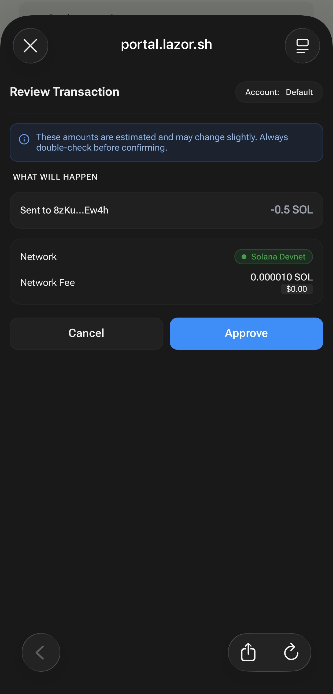
  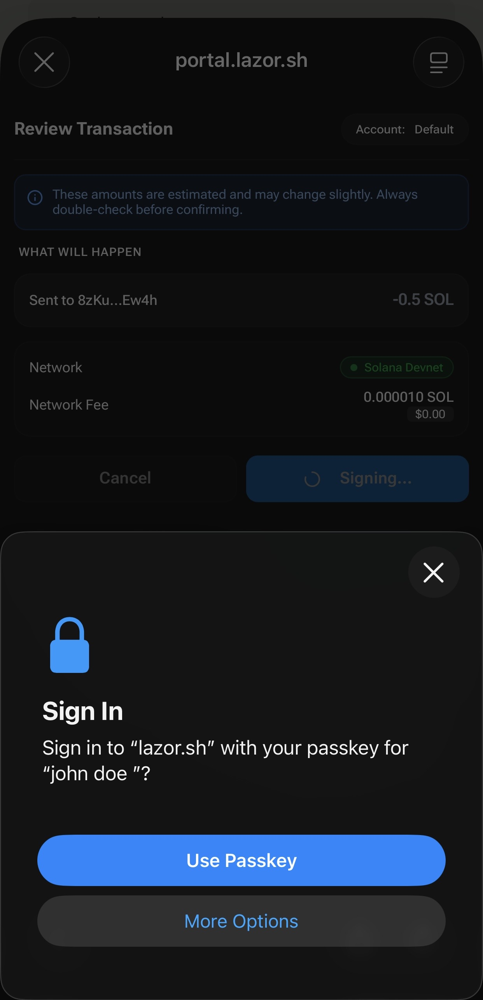
</p>

### Token Swaps
<p align="left">
  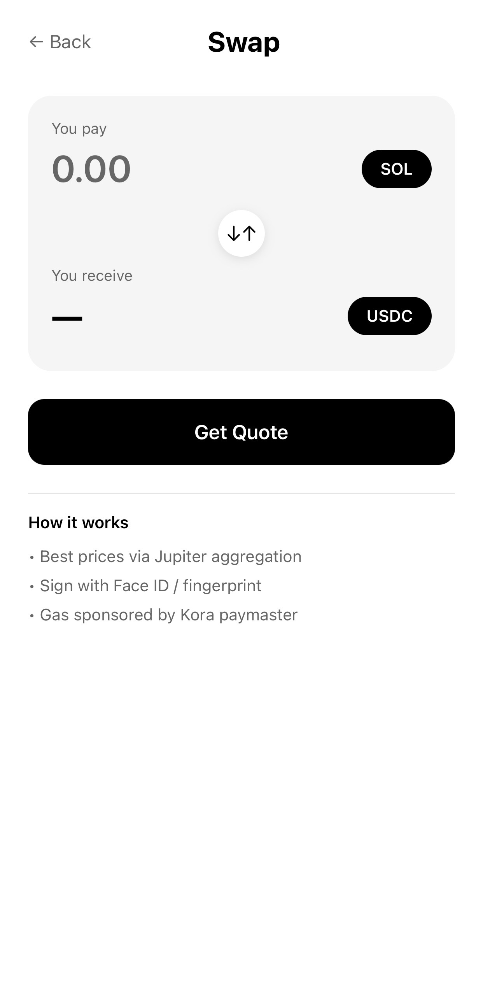
</p>

### Stealth Addresses
<p align="left">
  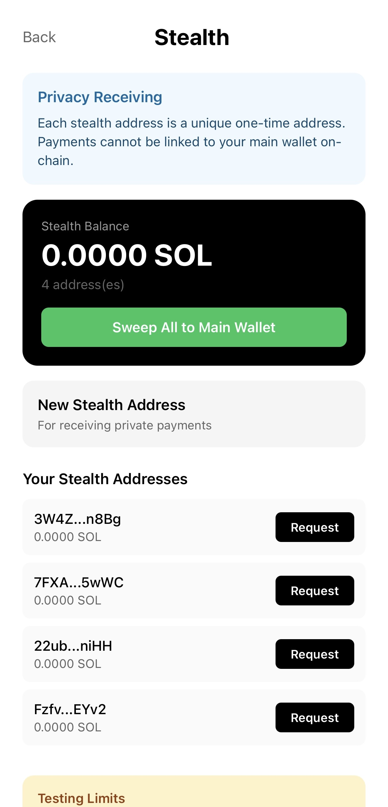
  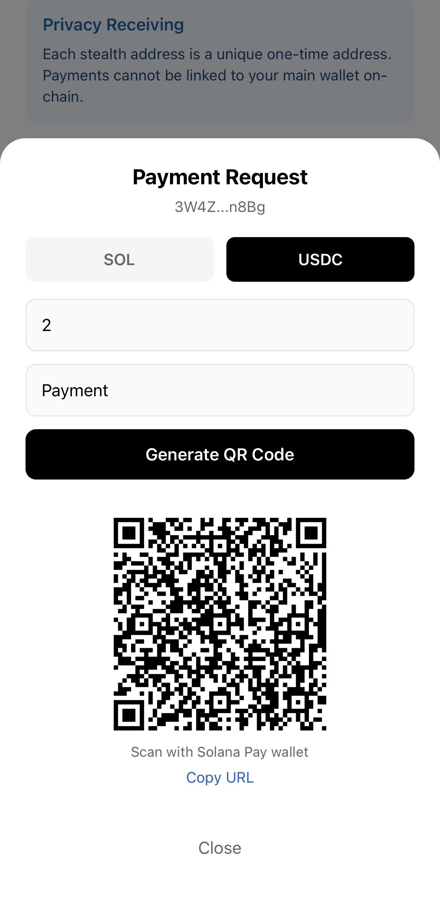
</p>

### Burner Wallets
<p align="left">
  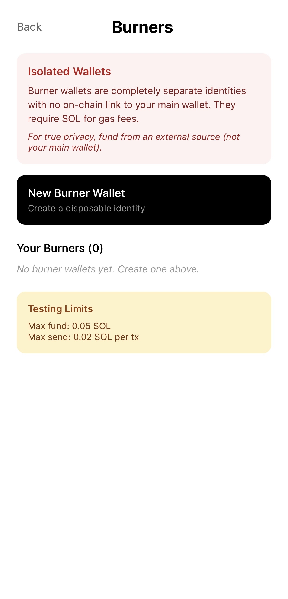
  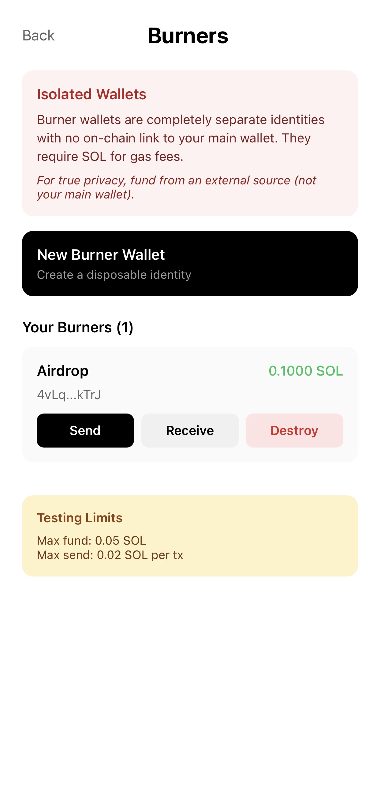
</p>

## Features

- **Passkey authentication** - FaceID, TouchID, fingerprint. No seed phrase ever.
- **Gasless transactions** - Send, swap, and sign without holding SOL for fees
- **Jupiter swaps** - Best-price token swaps, completely gas-free
- **Stealth addresses** - One-time receiving addresses for private payments
- **Burner wallets** - Disposable identities with zero on-chain link
- **Private mode** - Hide balances, biometric auth to reveal
- **SEED token tracking** - Native balance display for the SEED token
- **Address validation** - Input validation before transactions to prevent errors

## Setup

```bash
git clone https://github.com/francis-codex/seedless.git
cd seedless
npm install
```

Copy `.env.example` to `.env` and add your keys:

```bash
cp .env.example .env
```

```
EXPO_PUBLIC_HELIUS_API_KEY=your-helius-api-key
EXPO_PUBLIC_JUPITER_API_KEY=your-jupiter-api-key
EXPO_PUBLIC_PAYMASTER_API_KEY=your-kora-api-key
```

Run:

```bash
npx expo start
```

## Tech Stack

React Native (Expo) / TypeScript / LazorKit SDK / Kora Paymaster / Solana Web3.js / Jupiter API

## Beta Phases

| Phase | Focus | Status |
|-------|-------|--------|
| Phase 1 | Core wallet, passkeys, gasless sends | Completed |
| Phase 2 | Jupiter swaps, stealth addresses, burner wallets | Completed |
| Phase 3 | UX polish, balance display, error handling | Active |
| Mainnet | Production launch on Solana mainnet | Pending audit |

## Links

- [Landing Page](https://seedlesslabs.xyz)
- [Roadmap](https://seedlesslabs.xyz/#roadmap)
- [Twitter](https://x.com/seedless_wallet)
- [Seedless Labs](https://github.com/seedless-labs)

## License

MIT
